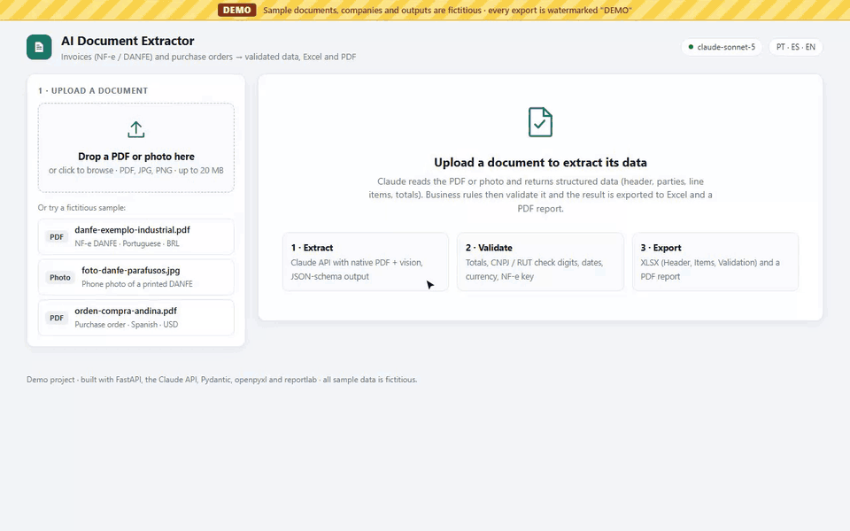
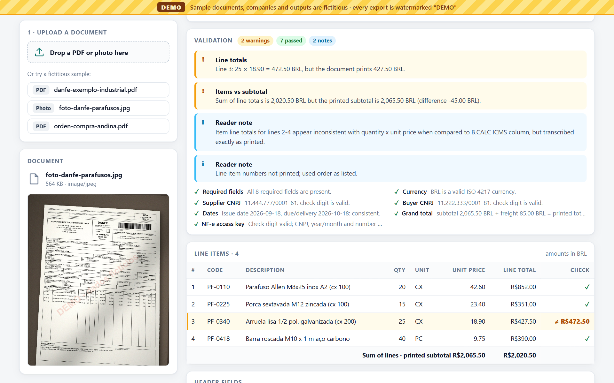
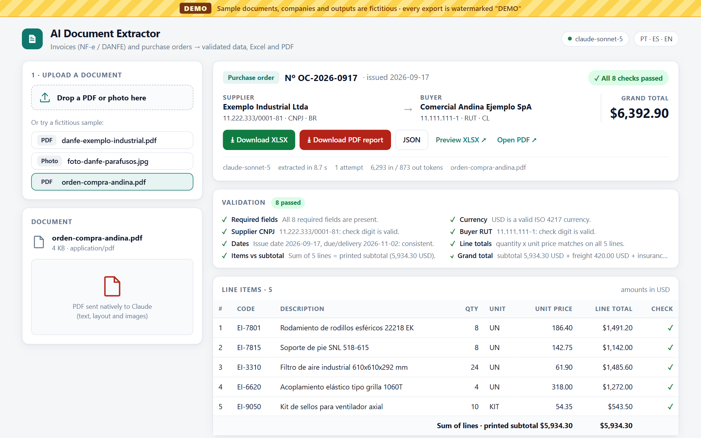
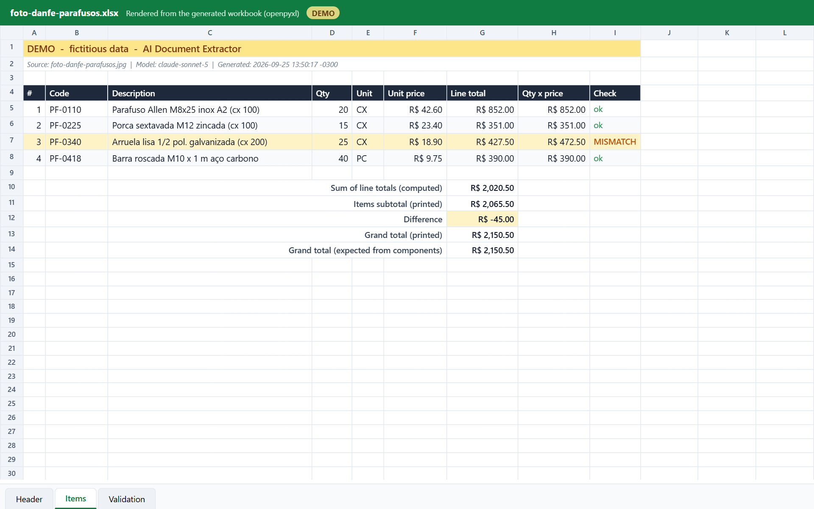

# AI Document Extractor (demo)



> **This is a demo project.** All sample documents are fictitious: companies, amounts and access keys were invented for this repository, and every export is watermarked **DEMO**. The tax IDs are textbook examples with valid check digits (CNPJ `11.222.333/0001-81` and `11.444.777/0001-61`, RUT `11.111.111-1`, and the alphanumeric CNPJ format example `12.ABC.345/01DE-35`); any match with a real registration is coincidental.

[Watch the MP4](docs/demo.mp4) · [Versión en español](README.es.md) · Python 3.12 · FastAPI · Claude API · Pydantic · openpyxl · reportlab

The GIF and the screenshots were recorded from real Claude API calls (`claude-sonnet-5`). The wait for the model is fast-forwarded in the GIF, and a badge on screen shows the real duration.

## Problem

Procurement and accounts-payable teams retype data from supplier invoices (Brazilian NF-e / DANFE) and purchase orders into spreadsheets and ERPs. The documents arrive as PDFs or phone photos, in Portuguese, Spanish or English, with local number formats (`1.234,56`, `US$ 6.392,90`). Typing errors, such as a transposed digit in a line total or a wrong CNPJ, get through and only show up later, at payment or tax reconciliation.

## Solution

Upload a PDF or a photo and get structured data back. On the three sample documents, the model call took 9.9 to 11.4 seconds each (numbers below). The arithmetic and the tax IDs are checked before anyone relies on the numbers.

1. **Extract.** Claude reads the PDF natively (text and layout) or the photo (vision). It has to answer in a JSON schema defined with Pydantic (structured output): header, supplier, buyer, line items and totals.
2. **Validate.** Business rules run on top of the typed data:
   - quantity × unit price = line total, on every line
   - sum of the lines = printed subtotal
   - subtotal − discount + freight + insurance + other charges + taxes = grand total
   - CNPJ check digits (including the 2026 **alphanumeric CNPJ**), CPF and Chilean **RUT**
   - NF-e access key: mod-11 check digit, and the CNPJ, year/month and number inside it must match the document
   - dates, required fields, ISO 4217 currency (for example, CLP must have no decimals)
3. **Export.** An **XLSX** file (sheets Header, Items and Validation), a **PDF report** and JSON, all marked DEMO.

The model is told to transcribe what is printed and never to "fix" a total, so validation can catch errors that are on the document itself. The photo sample has a deliberate typo: line 3 is printed as `427,50` instead of 25 × 18,90 = `472,50`. In the real run below, Claude transcribed the `427,50` as printed and the validation flagged it twice: once on the line and once on the subtotal.

## Results on the bundled samples

One live run per sample on 2026-09-25, model `claude-sonnet-5`, effort `medium`. Each extraction is compared field by field with the ground truth (`samples/truth/`): 14 header fields, 4 fields per party (name, tax ID, ID type, country), the number of items and 6 fields per item. The full report is in [`examples/output/accuracy.md`](examples/output/accuracy.md), and the JSON, XLSX and PDF of each run are next to it.

| Sample | Fields correct | Validation result | Model call | Tokens (in / out) |
|---|---|---|---|---|
| `danfe-exemplo-industrial.pdf` | 53/53 | all checks passed | 11.33 s | 7,617 / 1,035 |
| `foto-danfe-parafusos.jpg` | 47/47 | 2 warnings: line 3 total, items vs subtotal (the deliberate typo) | 11.37 s | 8,566 / 1,004 |
| `orden-compra-andina.pdf` | 53/53 | all checks passed | 9.91 s | 6,293 / 879 |

The first live run did not get everything right, and that report is kept in [`examples/output/accuracy-first-run.md`](examples/output/accuracy-first-run.md). The prompt then asked for the NF-e access key as "44 digits, no spaces", and on both DANFEs the key came back 1 or 2 digits short (52/53 and 46/47 fields). The NF-e key check caught both. The key is now copied as printed, with the spaces between the 4-digit groups, and the run above is the one after that change.

These are three synthetic documents and one run each: they show the pipeline working end to end, not a benchmark. Real scans can be harder, and that is what the validation step is for.

## Screenshots

| Photo: validation flags the typo | Purchase order in Spanish (USD, RUT) | Generated XLSX, Items sheet |
|---|---|---|
|  |  |  |

## Stack

| Layer | Choice |
|---|---|
| Extraction | [Claude API](https://docs.claude.com) via the official `anthropic` SDK: native PDF input, vision for photos, structured output (`messages.parse` with a Pydantic model). The default model is `claude-sonnet-5`; change it with `ANTHROPIC_MODEL`. |
| Validation | Pydantic v2 models + a small rule engine (`app/validation.py`) |
| Web | FastAPI + **one** HTML/JS page, with no front-end framework |
| Exports | openpyxl (XLSX), reportlab (PDF) |
| Tooling | pytest, Playwright (demo recording), imageio + imageio-ffmpeg (GIF/MP4) |

## Features

- **Web UI**: drag-and-drop upload or one-click samples, a processing view with a live timer, a summary card, the validation checklist, line items with mismatches highlighted, download buttons, and in-browser previews of the generated PDF and XLSX.
- **CLI**: `python extract.py <file>` prints the extraction and the checks and writes the JSON, XLSX and PDF. Exit code `0` means OK, `1` means needs review, `2` means the file could not be processed.
- **Robust input handling**: the file type is detected from the content, not the extension. Photos are rotated by EXIF, downscaled and stripped of metadata. Empty, truncated and oversized files are rejected before any API call. A failed run leaves no empty folder behind.
- **Explicit retry policy**: one retry on a timeout, a network error, 429/5xx, or an invalid or truncated structured response. A bad API key or model name fails immediately with a clear message.
- **Two ways to try it without an API key** (bundled samples only, matched by SHA-256):
  - `replay` serves the results saved by the real run in `examples/output/`, labelled as a replay.
  - `offline` skips Claude and loads each sample's hand-written answer key from `samples/truth/`. The UI, the exports and the CLI say so on every output. It is there to try the validation and the exports; it says nothing about extraction quality.
- **Tests**: 40 offline tests covering tax-ID algorithms, business rules, exporters, file checks, the retry policy (with a fake client), the three modes, and the request the SDK builds (mock HTTP transport).

## Design note: two schemas

`app/schema.py` has the model the rest of the code uses (`ExtractedDocument`, with optional fields) and a stricter one that is sent to Claude (`WireDocument`). The first live request sent `ExtractedDocument` as is, and the API answered `400 Schema is too complex`: it had 28 optional fields and 27 nullable (`X | None`) unions. In `WireDocument` every field is required, text that is not printed comes back as `""`, and only numbers can be `null`. That leaves 0 optional fields and 11 unions. `to_document()` converts the answer back, and a test checks that the round trip is lossless.

## Sample documents (`samples/`)

All generated by `scripts/make_samples.py`. The ground truth is in `samples/truth/`.

| File | What it is | Expected validation |
|---|---|---|
| `danfe-exemplo-industrial.pdf` | NF-e DANFE, Portuguese, BRL, 5 items, IPI, freight, discount; the buyer has an alphanumeric CNPJ | all checks pass |
| `orden-compra-andina.pdf` | Purchase order in Spanish from a Chilean company (RUT) to a Brazilian supplier (CNPJ), USD, CIF | all checks pass |
| `foto-danfe-parafusos.jpg` | "Phone photo" of a printed DANFE (perspective, shadow, noise) | **2 warnings**: line 3 total and items vs subtotal (deliberate typo) |

## How to run

You need Python 3.12. Live mode also needs an [Anthropic API key](https://console.anthropic.com/); the `replay` and `offline` modes do not.

### Windows (PowerShell)

```powershell
git clone https://github.com/joao-jleite/ai-document-extractor-demo.git
cd ai-document-extractor-demo
py -3.12 -m venv .venv
.venv\Scripts\python -m pip install -r requirements.txt
Copy-Item .env.example .env                           # then edit .env and set ANTHROPIC_API_KEY
.venv\Scripts\python -m uvicorn app.server:app --port 8000   # open http://localhost:8000
```

CLI: `.venv\Scripts\python extract.py samples\foto-danfe-parafusos.jpg`

Calling `.venv\Scripts\python` directly works without activating the venv. If you prefer to activate it and PowerShell blocks `Activate.ps1` ("running scripts is disabled on this system"), allow scripts for the current window only, then activate:

```powershell
Set-ExecutionPolicy -Scope Process -ExecutionPolicy Bypass
.\.venv\Scripts\Activate.ps1
```

### Linux / macOS

```bash
git clone https://github.com/joao-jleite/ai-document-extractor-demo.git
cd ai-document-extractor-demo
python3.12 -m venv .venv && source .venv/bin/activate
pip install -r requirements.txt
cp .env.example .env               # then edit .env and set ANTHROPIC_API_KEY
uvicorn app.server:app --port 8000 # open http://localhost:8000
```

CLI: `python extract.py samples/foto-danfe-parafusos.jpg`

### Without an API key

```bash
# Linux/macOS
EXTRACTOR_MODE=replay uvicorn app.server:app --port 8000
python extract.py samples/orden-compra-andina.pdf --replay     # saved results of the real run
python extract.py samples/foto-danfe-parafusos.jpg --offline   # answer key, Claude is not called
```

```powershell
# Windows (PowerShell)
$env:EXTRACTOR_MODE = "replay"
.venv\Scripts\python -m uvicorn app.server:app --port 8000
.venv\Scripts\python extract.py samples\orden-compra-andina.pdf --replay
.venv\Scripts\python extract.py samples\foto-danfe-parafusos.jpg --offline
```

Use `EXTRACTOR_MODE=offline` the same way for the answer-key mode. Both modes only accept the three bundled samples.

### Configuration (`.env`)

| Variable | Default | Meaning |
|---|---|---|
| `ANTHROPIC_API_KEY` | none | required in live mode |
| `ANTHROPIC_MODEL` | `claude-sonnet-5` | any Claude model that supports structured output |
| `ANTHROPIC_EFFORT` | `medium` | `low` / `medium` / `high` reasoning effort |
| `EXTRACT_TIMEOUT_SECONDS` | `120` | per-request timeout (one retry on timeout) |
| `MAX_UPLOAD_MB` | `20` | upload size limit |
| `EXTRACTOR_MODE` | `live` | `live`, `replay` or `offline` |

### Tests and tooling

```bash
pip install -r requirements-dev.txt
python -m playwright install chromium   # once, for the demo recording (Playwright 1.58.0)
pytest                                  # 40 offline tests, no API key needed
python scripts/make_samples.py          # regenerate the fictitious samples + ground truth
python scripts/run_samples.py           # real extraction of all samples + accuracy report
python scripts/build_demo_assets.py     # samples + Playwright recording + GIF/MP4 + screenshots
```

On Windows without an activated venv, prefix each command with `.venv\Scripts\python -m` (for example `.venv\Scripts\python -m pytest`) or `.venv\Scripts\python` for the scripts.

## Project structure

```
app/
  schema.py        Pydantic models: ExtractedDocument + the WireDocument sent to Claude
  extractor.py     Claude call: PDF/image input, structured output, retry policy
  validation.py    business rules: totals, CNPJ/CPF/RUT, NF-e key, dates, currency
  exporters.py     XLSX (openpyxl) and PDF report (reportlab), marked DEMO
  pipeline.py      file -> extraction (live / replay / offline) -> validation -> exports
  server.py        FastAPI endpoints
  xlsx_preview.py  renders the generated .xlsx as HTML, reading the real file
static/index.html  the whole UI (HTML + CSS + JS)
extract.py         CLI
samples/           fictitious documents + ground truth
examples/output/   outputs of the real run + accuracy reports
docs/              demo GIF, MP4 and screenshots
scripts/           sample generator, accuracy check, demo recording, GIF/MP4
tests/             pytest suite
```

## Limitations

- This is a demo, not a fiscal validator. It does not query SEFAZ, and it does not recompute ICMS/IPI.
- LLM extraction can be wrong, especially on poor photos (the first run above got the NF-e keys wrong). That is why every number goes through the validation rules and the UI marks what needs human review.
- Documents are sent to the Anthropic API. For real data, check your data-processing requirements first.

## About

Built by **João Vitor Sousa Leite** ([github.com/joao-jleite](https://github.com/joao-jleite)). Before moving to freelance development, I worked as a procurement buyer and solo IT analyst at Zitron Brasil (2025–2026). Brazilian NF-e and purchase orders with Chilean suppliers in BRL, USD and CLP were part of my daily work there, so these rules automate the kind of checks (line math, totals, tax IDs) I used to do manually.

## License

[MIT](LICENSE). The sample documents are fictitious and free to reuse.
